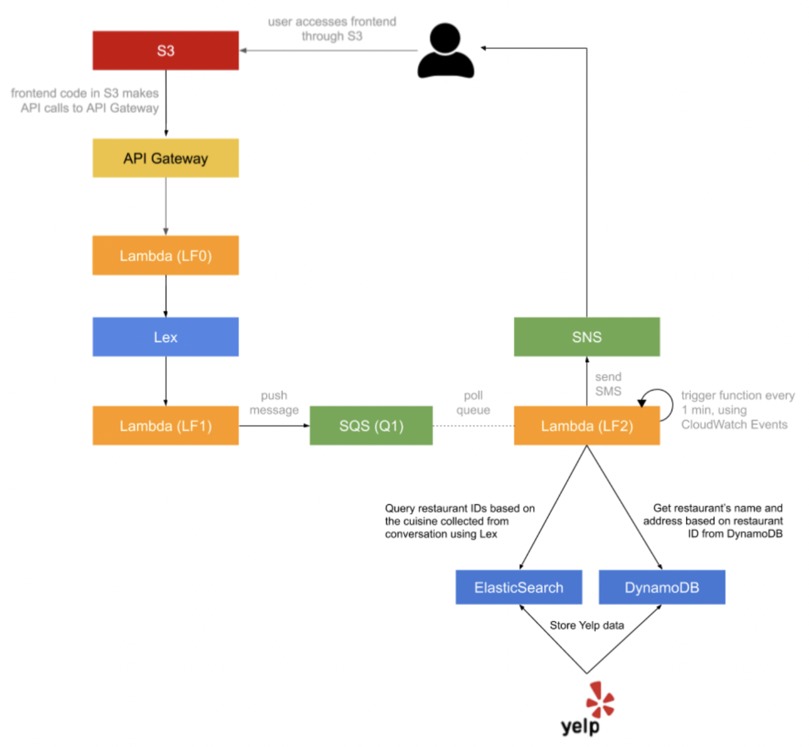

# Dining-Concierge-AI-ChatBot
A serverless chatbot with event-driven microservices using S3, Lambda, SQS, SNS, Lex, DynamoDB & ElasticSearch. A recommendation pipeline has been designed 
for automatically sending restaurant suggestions through texts based on user preferences. The application scrapes thousands of restaurants through Yelp API 
and enhanced recommendations based on current and previous customer chats

## Architecture


## Features of AI Bot

#### Lex Intents
```
The Lexbot uses the following three intents:
1. GreetingIntent
2. ThankYouIntent
3. DiningSuggestionsIntent
The implementation of an intent entails its setup in Amazon Lex as well as handling 
its response in the Lambda function code hook.
```
#### Greeting Intent
```
1. Created the intent in Lex
2. Trained and tested the intent in the Lex console,
3. Implemented the handler for the GreetingIntent in the Lambda code hook, such that when a 
   request for the GreetingIntent is received, a response is composed such as “Hi there, how can I help?”
```
#### Dining Suggestions Intent
```
1. The bot collects the following pieces of information from the user, through conversation:
    a. Location
    b. Cuisine
    c. Dining Time
    d. Number of people
    e. Phone number
 2. Based on the parameters collected from the user, the information is pushed to an SQS queue. 
 3. Users are notified over SMS once with the list of restaurant suggestions.
```
#### Integrate Lex chatbot to frontend chat API
```
1. AWS SDK is used to integrate Lex chatbot to frontend chat API from API lambda. 
2. Text message is extracted from the received API response.
3. This message is sent to Lex chatbot
4. Response sent back from Lex using API response.
```
#### AWS OpenSearch
```
1. AWS ElasticSearch is used to create an ElasticSearch instance.
2. An ElasticSearch index named "restaurants" is created.
3. Partial information for each restaurant, scraped in ElaticSearch, is stored under this "restaurants" index. 
4. Each entry in this index has a "Restaurant" custom data type. 
5. Restaurant Cuisine and ID is stored for each restaurant.
```
#### Web Scrapping Restaurant Data
```
1. Yelp API is used to collect more than 5000 restaurants in the area od Manhatten, New York.
2. Restaurants are obtained by numerous cuisine types.
3. For each cuisine, more than 1000 restaurants and their information are scraped.
4. Duplicates are handled or subsequently removed.
```

#### Databases Used
```
1. Utilized AWS DynamoDb (a noSQL database) to implement this application
2. A DynamoDB table is created and given a name, example "yelp-restaurants"
3. The restaurant information is stored in DynamoDb as not all restaurants might have the 
same number of fields which makes this noSQL database ideal for storing this data.
4. A key is attached to each stored item and given a mane like "insertedAtTimestamp" with time and date of the particular record. 
5. Fields important for restaurant suggestion/recommendation are stored. For this application, following were stored:
  a. Business ID
  b. Name of Restaurant
  c. Address/location
  d. Coordinates
  e. Number of Reviews
  f. Rating
  g. Zip Code
```
#### Restaurant Suggestions Feature
```
1. A new Lambda function (LF2) is created that acts as a queue worker. 
  a. Whenever it is invoked, it pulls a message from the SQS queue (Q1).
  b. A restaurant recommendation for the given cuisine is collected through conversation of ElasticSearch and DynamoDB.
  c. This message is formatted and sent as text message to the phone number specified in the SQS message using AWS SNS.
2. The DynamoDB table "yelp-restaurants" is used to fetch more information about the restaurants like restaurant name, address, etc., 
since the restaurants stored in ElasticSearch will have only a small subset of fields from each restaurant.
3. The rest of the LF2 function is modified is required to send the user a text message or email of suggestions.
4. Cloudwatch Event Trigger (runs every minute and invokes Lambda function as a result) is used to automate 
the queue worker Lambda to poll and process suggestion requests on its own.
5. Based on conversation with the customer, the LEX chatbot will identify the customer's preferred "cuisine" 
by searching through ElasticSearch to get random suggestions of restaurants IDs with this cuisine.
6. The DynamoDB table is then queried using the same restaurant IDs to find more information about the 
suggested restaurants to customers like name and address of the restaurant.
```
#### Memory Feature

```
This chatbot also remembers a particular user's previous interaction and suggestions given (if any). 
When the same user returns to get suggestions, they are automatically sent a text message of 
their previous search recommendations. 
```

## Result
#### Example User conversation with Chatbot
```
Chatbot: Hi there, how can I help?
User: I want to eat/I need some restaurant suggestions/ Do you know any good restaurants in the area?
Chatbot: What city or city area are you looking to dine in?
User: Manhattan
Chatbot: Sure! What cuisine are you craving today?
User: Japanese
Chatbot: Perfect choice! How many people will accompany you?
User: Two
Chatbot: Great! At what date do you want to go?
User: Today
Chatbot: What time?
User: 7pm would be great
Chatbot: Awesome! I would need your phone number to send you my suggestions
User: My number is 458-193-9891
Chatbot: You are all set! Expect my suggestions shortly! Have a nice day.
User: Thank you!
Chatbot: Your welcome!
```
#### Text Message obtained on user-mobile:
``` 
“Hello! Here are my Japanese restaurant suggestions for 2 people, for today at 7 pm: 
1. Sushi Nakazawa, located at 23 Commerce St, 
2. Jin Ramen, located at 3183 Broadway, 
3. Nikko, located at 1280 Amsterdam Ave. Enjoy your meal!”
```
